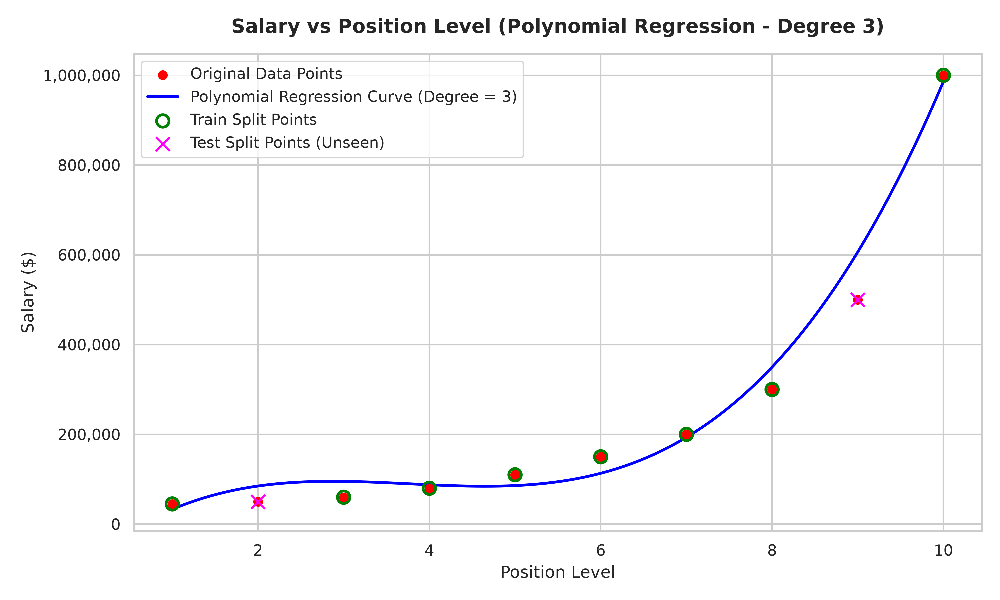

# 💰 Salary Prediction using Polynomial Regression

This repository contains the implementation of **AI-ML Assignment – 3**, which focuses on predicting employee salaries using **Polynomial Regression**. Since the relationship between an employee's position level and salary is non-linear, Polynomial Regression provides a more accurate model than Linear Regression for estimating salaries.

---

## 👤 Student Details

- **Name:** Taran Ali Ahmed
- **Registration Number:** 23BCE10952
- **Application Number:** IN26009846
- **Batch:** 2B

---

## 📌 Objective

The objective of this project is to predict employee salaries based on their position levels using a **Polynomial Regression model (Degree = 3)**.

Unlike Linear Regression, which assumes a straight-line relationship between variables, Polynomial Regression captures the non-linear growth of salaries across different organizational levels, resulting in improved prediction accuracy.

---

## 📊 Dataset

This project uses the **Position Salaries Dataset**.

- **Kaggle Dataset:** https://www.kaggle.com/datasets/akram24/position-salaries

### Dataset Features

| Column | Description |
|--------|-------------|
| **Position** | Employee designation (Business Analyst, Manager, CEO, etc.) |
| **Level** | Numeric representation of the position level (1–10) |
| **Salary** | Annual salary (USD) |

> **Note:** As per the assignment guidelines, the dataset (`Position_Salaries.csv`) is excluded from the repository using `.gitignore`.

---

## 🛠️ Libraries Used

The following Python libraries were used during implementation:

- **Pandas** – Data loading and preprocessing
- **NumPy** – Numerical operations
- **Scikit-Learn**
  - `PolynomialFeatures`
  - `LinearRegression`
  - `train_test_split`
  - Performance metrics
- **Matplotlib** – Data visualization
- **Seaborn** – Enhanced plotting

---

## ⚙️ Methodology

### 1. Data Understanding

- Loaded the dataset using Pandas.
- Explored the dataset structure and summary statistics.
- Verified that there were **no missing values**.
- Selected:
  - **Input Feature (X):** Position Level
  - **Target Variable (y):** Salary

---

### 2. Data Preprocessing

- Reshaped the feature array into a two-dimensional format.
- Split the dataset into:
  - **80% Training Data**
  - **20% Testing Data**
- Used `random_state = 42` to ensure reproducibility.

**Training Levels:** `[6, 1, 8, 3, 10, 5, 4, 7]`

**Testing Levels:** `[9, 2]`

---

### 3. Model Development

The input feature was transformed into **third-degree polynomial features** using:

$$
y = \theta_0 + \theta_1x + \theta_2x^2 + \theta_3x^3
$$

A **Linear Regression** model was then trained on these transformed features to learn the non-linear relationship between position level and salary.

---

### 4. Model Evaluation

The model was evaluated using:

- Mean Absolute Error (MAE)
- Mean Squared Error (MSE)
- Root Mean Squared Error (RMSE)
- R² Score

Finally, the regression curve was plotted to compare the predicted trend with the original data.

---

# 📈 Results

## Model Performance

| Metric | Value |
|---------|------:|
| **Training R² Score** | **0.9913** |
| **Testing R² Score** | **0.8763** |
| **Mean Absolute Error (MAE)** | **$70,635.25** |
| **Mean Squared Error (MSE)** | **6,263,853,282.86** |
| **Root Mean Squared Error (RMSE)** | **$79,144.51** |

---

## Predicted vs Actual Salaries

| Position Level | Actual Salary ($) | Predicted Salary ($) | Prediction Error ($) |
|---------------:|------------------:|---------------------:|---------------------:|
| **2** | 50,000 | 124,198.81 | +74,198.81 |
| **9** | 500,000 | 432,928.31 | -67,071.69 |

---

## 📊 Regression Curve

The visualization below shows:

- 🔴 Original dataset points
- 🟢 Training samples
- 🟣 Testing samples
- 🔵 Polynomial Regression curve

---

## 🔍 Key Observations

### ✅ Strong Non-linear Fit

The Polynomial Regression curve closely follows the exponential growth pattern of salaries, particularly for higher position levels (Levels 8–10), where Linear Regression would significantly underfit.

### ✅ High Predictive Performance

The model achieved an **R² score of 0.9913** on the training set and **0.8763** on the testing set, indicating strong predictive capability despite the small dataset.

### ✅ Minor Prediction Errors

The model slightly overestimates the salary at **Level 2** because the polynomial curve prioritizes fitting the overall trend, especially the steep salary increase at executive levels. Given that the dataset contains only **10 observations**, this level of error is expected.

---

## 📝 Conclusion

This project demonstrates that **Polynomial Regression (Degree = 3)** is highly effective for modeling the non-linear relationship between employee position level and salary.

### Key Findings

- Salary growth across organizational levels is strongly **non-linear**.
- Linear Regression underfits this dataset because it assumes a linear relationship.
- Polynomial Regression introduces higher-degree terms that capture complex salary trends.
- The trained model explains **99.13%** of the variance in the training data and achieves **87.63%** predictive accuracy on the testing data.
- The regression curve accurately models the rapid increase in executive-level salaries while maintaining good predictive performance across lower levels.

Overall, the Polynomial Regression model successfully captures the salary trend and provides accurate predictions, making it well-suited for this dataset.
